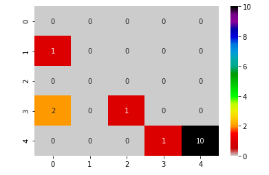
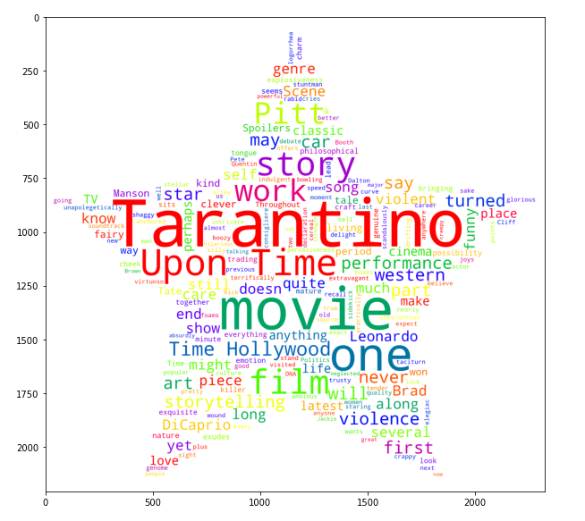

# Applying-NLP-on-Movie-Reviews
This is an introductory project using Natural Language Processing. The project takes various movie critics and their reviews to perform Sentiment Analysis to achieve a star rating and Similarity Analysis among same movie critics for different movies.

The analysis uses Natural Language Tool Kit (NLTK) and TextBlob library. 

## Creating the datasets:
I created the datasets considering:
There are two movies considered in the analysis and 10 famous critics who has provided a review on both of these movies. The reviews are taken from imdb and critic's own websites.

## Sentiment Analysis using Naive Bayes Analyzer
Based on the review by each critic, Naive Bayes Sentiment Analyzer is used to give information about the positive and negative rating. This rating is converted to the star rating of 1-5 based on the positivity. The actual rating is compared with the derived rating (Bayes Rating) using the Sentiment Analyzer and the prediction score is calculated.

This process is done for each review for both the movies and star rating (Bayes Rating) is achieved to compare with the actual rating. A confusion matrix is also prepared to give more insights.
## Similarity Analysis.
After achieving the star rating, a similarity analysis is performed among the reviews of same critics for both the movies. Spacy and pathlib are used to perform the similarity analysis.

## Confusion Matrix for Sentiment Analysis prediction

**Word clouds** have also been created for the most frequent words for reviews in each movies.
## Word Cloud for the Movie Reviews

